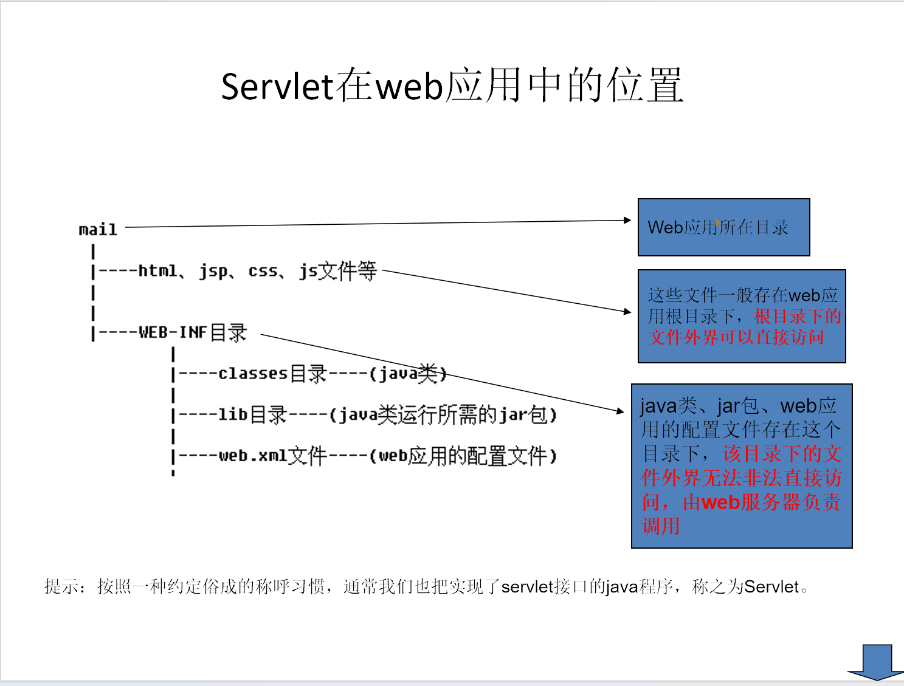
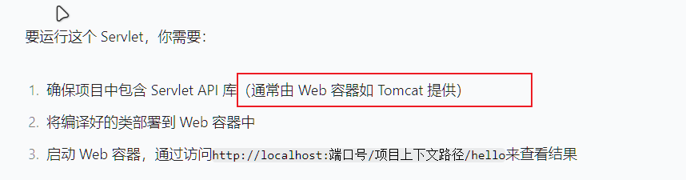
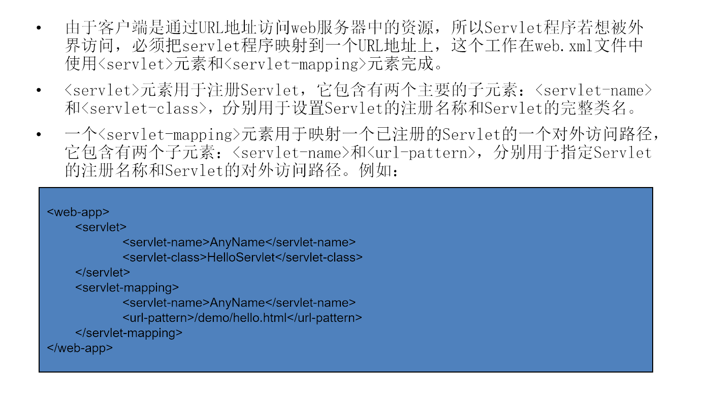
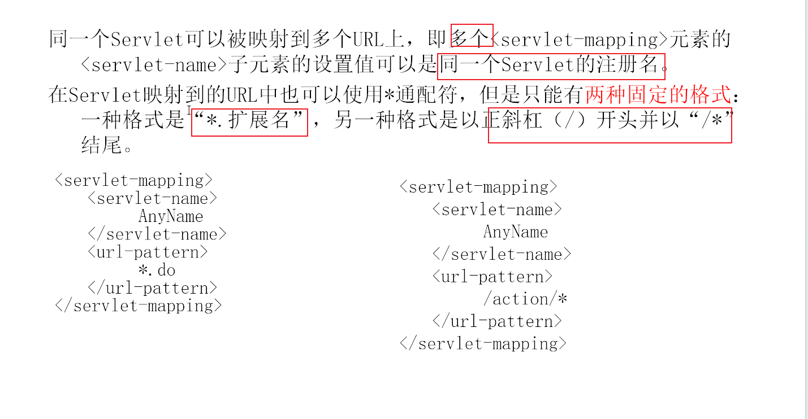
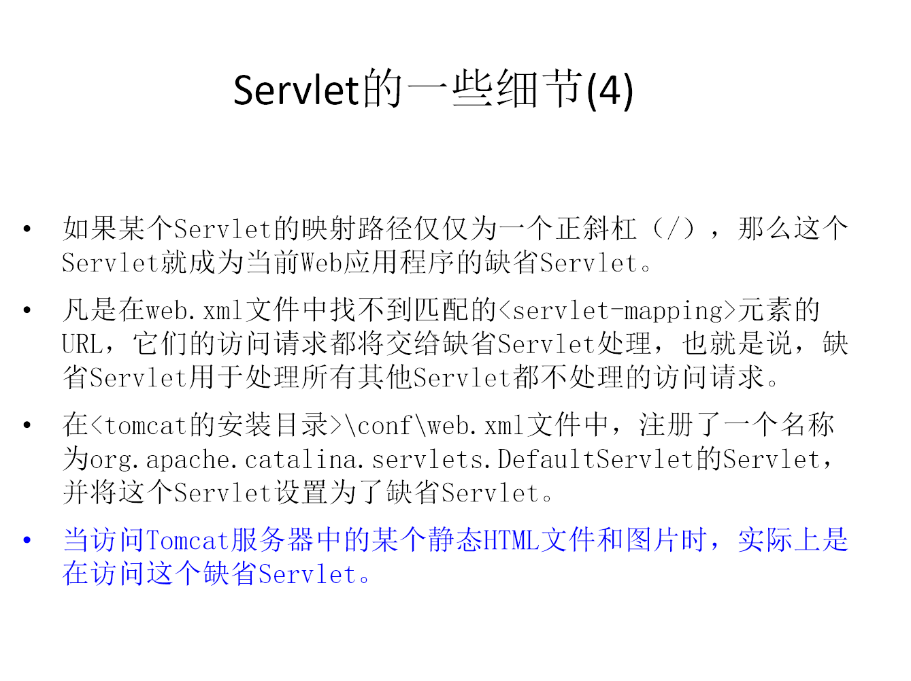
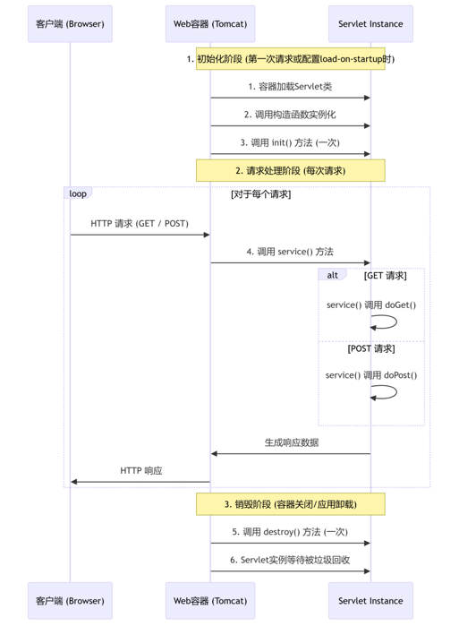

#  目录结构示意图




# 创建Servlet

```java
@WebServlet("/hello")
public class HelloServlet extends HttpServlet
{ ... }

//注解配置更简洁，是推荐方式。
//web.xml用于覆盖注解或需要动态配置的场景。

```


# 编写Servlet



```java
Servlet接口实现类
    
    
    
    1. Servlet接口SUN公司定义了两个默认实现类，分别为：GenericServlet、HttpServlet。

    2. HttpServlet指能够处理HTTP请求的servlet，它在原有Servlet接口上添加了一些与HTTP协议处理方法，它比Servlet接口的功能更为强大。因		此开发人员在编写Servlet时，通常应继承这个类，而避免直接去实现Servlet接口。
    
    3. HttpServlet在实现Servlet接口时，覆写了service方法，该方法体内的代码会自动判断用户的请求方式，如为GET请求，则调用HttpServlet	   的doGet方法，如为Post请求，则调用doPost方法。因此，开发人员在编写Servlet时，通常只需要覆写doGet或doPost方法，而不要去覆写            service方法。
    
		可以看看 HttpServlet API文档
    
    
 关于注解的作用：
    
    @WebServlet 是 Servlet 3.0 及以上版本 引入的注解，用于替代传统的 web.xml 配置文件，快速将一个 Java 类标记为 Servlet 组件，并指	定其核心配置信息（如访问路径、名称等），让 Web 容器（如 Tomcat）能够识别并管理该 Servlet。
    
    注解属性的含义
    name = "helloServlet"：
    指定当前 Servlet 的 名称（相当于 web.xml 中的 <servlet-name>）。
    作用：用于标识 Servlet，在应用中需唯一（但通常不影响客户端访问，更多是给容器和开发者识别用）。
    value = "/hello-servlet"：
    指定 Servlet 的 访问 URL 路径（相当于 web.xml 中的 <url-pattern>）。
    作用：客户端（如浏览器）通过该路径访问此 Servlet。例如：
    若应用部署在 http://localhost:8080/myapp，则可通过 http://localhost:8080/myapp/hello-servlet 访问该 Servlet。
	@WebServlet 还有一些可选属性，用于更灵活的配置：

    urlPatterns：与 value 功能完全一致（都是指定访问路径），但 value 更简洁，两者不能同时使用。例如：urlPatterns = {"/hello", 		"/hi"} 表示该 Servlet 可通过 /hello 或 /hi 访问。
    loadOnStartup：指定 Servlet 的加载时机（默认值为 -1）。
    若设为 0 或正数：Web 容器启动时就加载该 Servlet（数值越小，加载优先级越高）。
    若为 -1（默认）：首次被访问时才加载。
    initParams：配置初始化参数（相当于 web.xml 中的 <init-param>），例如：
    initParams = {@WebInitParam(name = "encoding", value = "UTF-8")}


```


# servlet的一些细节








~~~java
Servlet 的生命周期
    
    
    * Servlet是一个供其他Java程序（Servlet引擎）调用的Java类，它不能独立运行，它的运行完全由Servlet引擎来控制和调度。
    * 针对客户端的多次Servlet请求，通常情况下，服务器只会创建一个Servlet实例对象，也就是说Servlet实例对象一旦创建，它就会驻留在内存中，为后续的其它请求服务，直至web容器退出，servlet实例对象才会销毁。
    * 在Servlet的整个生命周期内，Servlet的init方法只被调用一次。而对一个Servlet的每次访问请求都导致Servlet引擎调用一次servlet的service方法。对于每次访问请求，Servlet引擎都会创建一个新的HttpServletRequest请求对象和一个新的HttpServletResponse响应对象，然后将这两个对象作为参数传递给它调用的Servlet的service()方法，service方法再根据请求方式分别调用doXXX方法。 
    *如果在<servlet>元素中配置了一个<load-on-startup>元素，那么WEB应用程序在启动时，就会装载并创建Servlet的实例对象、以及调用Servlet实例对象的init()方法。
    * eg：
    <servlet>		
        <servlet-name>invoker</servlet-name>		
        <servlet-class>org.apache.catalina.servlets.InvokerServlet</servlet-class>		
        <load-on-startup>2</load-on-startup>	
    </servlet>
     用途：为web应用写一个InitServlet，这个servlet配置为启动时装载，为整个web应用创建必要的数据库表和数据。
     
        


    
~~~




# Servlet的线程安全

```java
* 当多个客户端并发访问同一个Servlet时，web服务器会为每一个客户端的访问请求创建一个线程，并在这个线程上调用Servlet的service方法，因此service方法内如果访问了同一个资源的话，就有可能引发线程安全问题。
* 如果某个Servlet实现了SingleThreadModel接口，那么Servlet引擎将以单线程模式来调用其service方法。
* SingleThreadModel接口中没有定义任何方法，只要在Servlet类的定义中增加实现SingleThreadModel接口的声明即可。
* 对于实现了SingleThreadModel接口的Servlet，Servlet引擎仍然支持对该Servlet的多线程并发访问，其采用的方式是产生多个Servlet实例对象，并发的每个线程分别调用一个独立的Servlet实例对象。
* 实现SingleThreadModel接口并不能真正解决Servlet的线程安全问题，因为Servlet引擎会创建多个Servlet实例对象，而真正意义上解决多线程安全问题是指一个Servlet实例对象被多个线程同时调用的问题。事实上，在Servlet API 2.4中，已经将SingleThreadModel标记为Deprecated（过时的）。
```


# 解决并发问题

```
* 解决并发出现的问题，可以采用以下方式：
* 使用Java同步机制对多线程同步:运行效率低
* 使用SingleThreadModel接口（已被废弃）
* 合理决定在Servlet中定义的变量的作用域
1. 局部变量：首选方案。
2. 同步块：说明其性能影响。
3. 无状态对象：例如，避免在Servlet中定义可变的实例变量。

```


# ServletConfig对象

```
* 在Servlet的配置文件中，可以使用一个或多个<init-param>标签为servlet配置一些初始化参数。
* 当servlet配置了初始化参数后，web容器在创建servlet实例对象时，会自动将这些初始化参数封装到ServletConfig对象中，并在调用servlet的     init方法时，将ServletConfig对象传递给servlet。进而，程序员通过ServletConfig对象就可以得到当前servlet的初始化参数信息。
* 阅读ServletConfig API，并举例说明该对象的作用：
    获得字符集编码
    获得数据库连接信息

```


# 注解中如何定义初始化参数？

```java
@WebServlet(urlPatterns = "/config", initParams = {@WebInitParam(name = "encoding", value = "UTF-8")
})
```


# ServletContext

```
* WEB容器在启动时，它会为每个WEB应用程序都创建一个对应的ServletContext对象，它代表当前web应用。
* ServletConfig对象中维护了ServletContext对象的引用，开发人员在编写servlet时，可以通过ServletConfig.getServletContext方法获得     ServletContext对象。
* 由于一个WEB应用中的所有Servlet共享同一个ServletContext对象，因此Servlet对象之间可以通过ServletContext对象来实现通讯。             ServletContext对象通常也被称之为context域对象。
* 查看ServletContext API文档，了解ServletContext对象的功能。

```


# ServletContext应用

```
* 多个Servlet通过ServletContext对象实现数据共享。
* 获取WEB应用的初始化参数。
* 实现Servlet的转发。
* 利用ServletContext对象读取资源文件。
    .properties文件（属性文件）
    得到文件路径(ServletContext.getRealPath(),ServletContext.getReaourceAsStream())
    思考：如果一个普通类该如何读取配置文件？？
    读取资源文件的三种方式
* 练习作业：
1. 实现文件下载
2. 使用ServletContext实现网站访问计数器。


```


```

```

